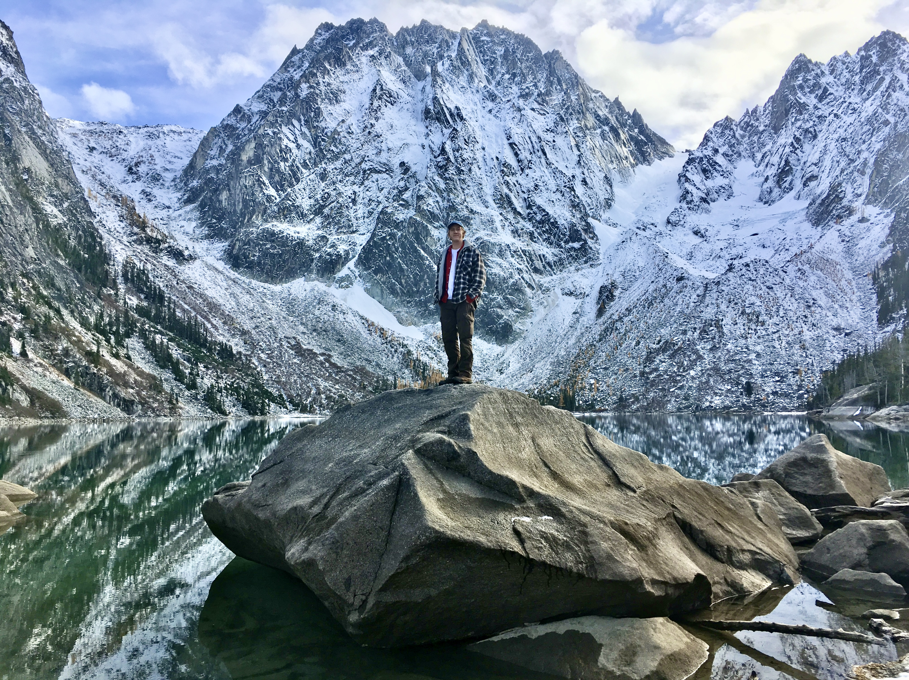

{width=90% fig-align="center"}

# About Me
<!-- ## Where I'm at now -->

I'm an incoming PhD student in Cognitive Science at UC San Diego, interested in the intersection of computation, neural dynamics, and intelligent systems. I was extremely lucky to get work on some amazing projects during my undergrad and postbacc years, and have become obsessed with what kinds of questions we can ask, and the insights we can generate, about the brain using stem-cell derived neural tissues (2D hiPSC and organoid cultures). In the past, I have used LFP and spike data to study oscillatory and aperiodic neural activity in the context of typical and atypical neurodevelopment. Going forward, I hope to explore the fundamental properties of biological neural networks to better understand how information is encoded and respresented in living systems. How does meaningful neural computation emerge? How do these compuations dynamically change over different timescales? How is information structured in noisy biological systems? How does the architecture of connectivity support network function? How is that function shaped by variance within and across cell types?... These are a few of the big questions that keep me up at night, and I am excited to devote some time to studying them.

In addition to my scientific aims, I hope to use my PhD time to create and support communities of students and researchers, specifically with the goal of lowering the barrier of entry for folks interested in pursuing a career in science. I believe that carving out space for different perspectives and skills is critical to advancing science and society as whole. I believe that community, inclusivity, and compassion are worth every effort to create and maintain.

<!-- ## Where I came from

I grew up in East County San Diego, and lived a couple different lives before returning to school for my bachelor's degree. Some people take a gap year or two, I took a decade. My first passion-turned-career was in horticulture, where I helped run a plant nursery and eventually started my own landscape and design business. I was, and still am, completely infatuated with the plant kingdom (and the fungi kingdom as well). -->
<!-- , and found it incredibly rewarding to get to work with all kinds of people to bring ethical and native gardens to homes across California and Washington. My favorite scientific plant name is *eschscholzia* (six consonants is just fun) and my favorite genus is probably Banksia. -->

<!-- After my horticultural endeavours I began a four-year apprenticeship making wine on and island in Western Washington. I did a little bit of everything--- driving semitrucks across the state to pick up grapes, running fermentations, barreling, selling, promoting, and yes, drinking, wine. As romantic as it might sound, 90% of winemaking is janitorial work, which means I became an expert in scrubbing and sanitizing equipment (eg. hoses, funnels, carboys, barrels, tanks, bins, bungs, presses, etc.). This work was also deeply satisfying, and eventually led to a short position with a fermented pickle company (turns out every fermentation business involves copious amounts of janitorial work). Eventually Covid happened and with the extra downtime to introspect, while eating pickles and drinking wine, I set my heart on returning to school to pursue neuroscience research... Despite the lack of acidic crunchy snacks and tannic beverages, it's been the best decision I've ever made. -->

<!-- ## Outside of the lab -->

When I'm not working on code or catching up on literature, I enjoy hiking and backpacking (the picture above is from a dayhike to the Enchantments in Washington State), playing ultimate frisbee or pickleball, jamming on piano, drinking a super hoppy IPA over a game of pool, and playing board games of all flavors.
<!-- My friends make fun of me for always showing up to a gathering with a boardgame (or ten), and my dentist thinks I do a good job of flossing (humble brag). I think about getting a dog a lot, but it's kind of like wanting to get a boat... it's way easier to have a friend with a boat. For now at least. -->

### Get in touch

Please reach out if you have any questions about my research or would like to chat about neuroscience. Collaboration is a foundational part of what I do, so if you have a project you think would be interesting to work on together, please do no hesitate to get in touch. The fastest way to reach me is by [email](mailto:ahutton@ucsd.edu). You can also find me on [GitHub](https://github.com/aphutton) and [LinkedIn](https://linkedin.com/in/austinphutton).

*Cheers!*
<!-- ## What I work on

My research investigates how complex, coordinated activity arises in neural systems over time. I approach this question from two complementary angles:

- **Human induced pluripotent stem cell (hiPSC)-derived cortical cultures** — a bottom-up model that lets us watch neural networks literally assemble themselves, with full experimental control over what we perturb and when.
- **Human EEG recordings** — a top-down view of the same phenomena, where oscillations, aperiodic activity, and connectivity patterns tell us how mature systems route and process information.

Bridging these scales is the core methodological thread of my work: the same computational tools (spectral decomposition, parameterized aperiodic/oscillatory fitting, connectivity estimation) apply to both, and the story only gets interesting when you compare across them.

## What draws me to this

I'm drawn to neural development because it sits at an unusual intersection: it's simultaneously one of the most mechanistic, physically concrete processes in biology (cells connect to cells, neurons fire or don't) and one of the most emergent (networks produce coordinated dynamics that no individual neuron contains). That tension — between reducible and irreducible explanations — is what I want to spend my career thinking about.

I also care about computational methods as a cultural practice, not just a toolset. Good science in this area depends on analyses that are open, reproducible, and shared as notebooks rather than described in prose. My [Research](research.qmd) page is organized around that principle.

## Background

Before starting my PhD, I earned my B.S. in Cognitive Behavioral Neuroscience from UC San Diego in 2025, graduating with Honors and Distinction. Along the way I worked in the Neural Crossroads Lab and participated in the STARTneuro training program, which shaped how I think about translating between experimental and computational neuroscience.

See my [CV](cv.qmd) for a full timeline of education, research experience, publications, and awards.

## Outside the lab

When I'm not working, I'm usually in the mountains — backpacking, scrambling, and taking too many photos of alpine lakes. I also [something else you care about].

\  -->

