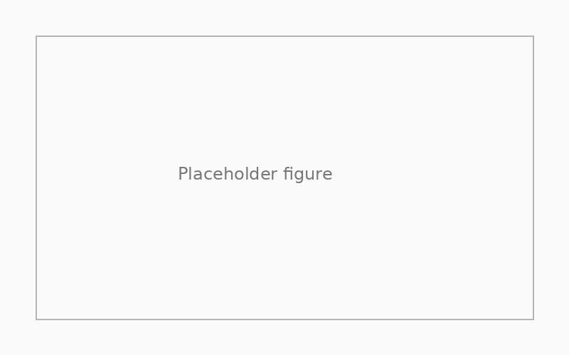

## Overview

Replace this file with a real project write-up. This is where you can drop images, text, math, and — most importantly — embedded Jupyter notebook output.

## Approach

Write a short methods section here. You can use **Markdown** freely, including math:

$$
P(f) = \frac{1}{f^{\chi}}
$$

## Results

Insert your main figure(s):



## Code & Notebook

For the full analysis notebook, [view on GitHub](https://github.com/aphutton/project-repo) or copy an `.ipynb` directly into this folder and reference it from the listing.

## Tip: replace this page with a notebook

Delete `index.qmd` and drop a Jupyter notebook named `index.ipynb` into this folder. Quarto will render the notebook directly. Example YAML to put at the top of the notebook (first cell, raw):

```
---
title: "My project"
description: "Short description"
date: "2026-04-22"
image: figure.png
---
```
